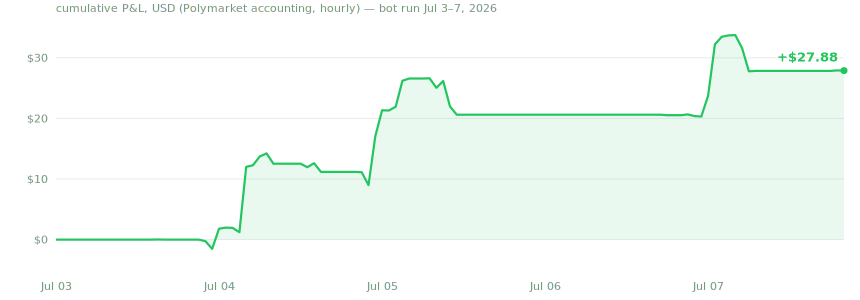

# polymarket-copybot

Single-file Polymarket copy-trading bot with a native desktop UI, quantitative
trader selection, risk gates on every copy, and chain-level reconciliation.
Watches one or more traders and mirrors their trades at a fraction of their size.

Built in a few days of pair-programming with Claude, then left running unattended
with real (small) money. Everything below is from that live run.

## Live results — first 4 days (Jul 3–7, 2026)



| Metric | Value |
|---|---|
| Bankroll at start | $33.11 |
| Balance at current marks (Jul 7 night, **after a red day**) | **$47.69** — $35.87 cash + $11.82 in open positions (**+44% since start**; intraday marks peaked near $88 during the Argentina–Egypt match before several legs lost) |
| Cumulative P&L, Polymarket accounting (hourly series, through Jul 7 20:00) | **+$27.88** (peak +$33.74, deepest trough −$1.54) |
| Settled copies | 29 — **18 won / 11 lost (62%)** |
| Capital returned by wins | $108.76 |
| Copies that never filled (FAK zero-fills, $0 moved, auto-refunded) | 6 |
| Biggest single-match result | Portugal–Spain: 3 legs, 3 wins, ~+$12.9 on ~$16 staked |

Every trade above is independently verifiable on-chain:
**[my live Polymarket profile](https://polymarket.com/@0x8df3ad8dd5893b65c23d8b3263b00fc507a1a75e-1780997991335)** —
the bot's wallet, fills, and P&L are public record, not screenshots.

Honest caveats: 4 days is a tiny sample — **four green days, then one red one**
(Jul 7: the USA–Belgium legs and a 14-cent Egypt longshot died together,
−$11 from the overnight high; the budget ratchet responded by shrinking the
deployable cap automatically). Open-position marks still swing; every edge was
measured during World Cup 2026, a uniquely liquid regime that ends July 19 —
the roster gets re-screened after that. This page is updated from the live
ledger, drawdowns included. Nothing here is financial advice.

### Not just football

The roster's edge travels across categories, and the run already proves it:

- **Esports (League of Legends, BO5 series)** — same-day resolution, deep
  in-play books. One copy rode MD14's T1 accumulation; another (Team Secret
  Whales) resolved LOST — both settled within hours, exactly the turnover
  profile the horizon math wants.
- **Crypto candle markets ("Bitcoin Up or Down, 10:45–11:00AM")** — the purest
  short-horizon instrument on the platform: 15-minute resolution. The copy
  entered 17:52, **won at 18:00** — eight minutes from signal to settled cash.
  Maximum capital velocity, but spread-sensitive: friction is a huge fraction
  of a 15-minute edge, so only high-conviction fills clear the gates.
- **Baseball (MLB run-line spreads)** — daily resolution; one Brewers copy
  FAK'd into a torn book and became a clean $0 zero-fill (the reconciler
  refunded it automatically).
- **Politics & macro (Fed meetings, elections, geopolitics)** — the targets
  trade these heavily; the bot deliberately *skips* them today. The full
  reasoning — and the math for when copying them becomes correct — is in the
  long-horizon section below.

## Why these traders — the selection math

The bot doesn't copy whoever tops the leaderboard. Candidates go through a
three-stage pipeline, and the final call is a friction-adjusted expected-value
estimate of what *copying* them transfers to you — which is not the same as
what *they* make. **The whole pipeline ships inside the bot**: a
"Scan for copyable traders" button runs it live (read-only, ~150 public API
calls, 2–3 min) and ranks the current leaderboard by net copy edge, with a
copy button next to anyone who passes.

### The model — a proper derivation

**Setup.** Copying trader T means: each time T buys a token at price p, the
bot buys the same token within seconds at price p′ ≤ p(1+s), with its own
sizing. Assume, over the estimation window, T's trades have a stationary
per-dollar edge (their fills beat fair value by e on average) and that our
fill quality differs from theirs only by measurable drift and spread costs.

**Lemma (expected transfer per mirrored dollar).** Let e be T's edge per
dollar traded, f the cost of one spread crossing, and q the probability T
exits a position early (rather than holding to resolution, which settles at
face value, frictionlessly). Then a copied dollar earns in expectation

```math
\mathbb{E}[\pi] \;=\; e \;-\; f\,(1 + q)
```

*Proof sketch.* The entry order always crosses the book once: cost f. With
probability q the target exits early; the mirrored exit crosses again: cost
q·f in expectation. Resolution needs no order. The copied position collects
T's edge e by construction (same token, price within the no-chase band, drift
empirically ≈ 0 — measured below). Linearity of expectation gives the sum. ∎

**Estimators.** Neither e nor q is observable directly, so both are estimated
from public fills over two windows w ∈ {7d, 30d}:

```math
\widehat{e}_w=\frac{\mathrm{PnL}_w}{V_w},
\qquad
\widehat{q}=\frac{\#\,\text{sell fills}}{\#\,\text{all fills}},
\qquad
\widehat{\mathrm{net}}_w=\widehat{e}_w-(1+\widehat{q})\,f
```

PnL-over-volume is their realized profit per dollar pushed through the market;
two windows are a cheap regime check (a hot week on a flat month reads very
differently from a consistently earning month) and yield an interval estimate
rather than a point.

**Arming rule.**

```math
\min_{w\in\{7\mathrm{d},30\mathrm{d}\}} \widehat{\mathrm{net}}_w \;>\; 0
```

— the edge must survive friction under the *pessimistic* estimate. This single
inequality is what killed the most tempting candidate of the run (see rejects
below).

### Where the 2.3% friction constant comes from

$f$ was measured, not assumed: at ~$5 order size on World-Cup-liquidity books,
crossing the spread on a FAK marketable order cost ≈2.3% of notional on
average (half-spread + queue slippage). Copy-lag, surprisingly, costs nothing
at this size — the bot records the drift between the target's fill price and
its own achievable price on **every live copy**:

> **55 live copies: median drift −0.5pp, mean −0.35pp** (negative = we filled
> *better* than the target), worst case +1.0pp — because the no-chase gate
> refuses any copy where the price already ran more than 2% past the target's
> fill. Lag risk is capped by construction; the spread is the real cost.

### Stage 1 — survival screens

From the 7d/30d leaderboards (top 50 each), a candidate survives if their
30-day equity curve shows:

- profit > $5k **and** ≥45% green days (steady accumulation, not one lucky hit)
- max drawdown < 70% of the month's profit — on the equity curve P:

```math
\max_{t}\Big(\max_{s\le t} P_s - P_t\Big) \;<\; 0.7\,(P_{30}-P_0)
```

  which filters the all-in martingale cowboys who eventually donate everything back
- traded within the last 3 days (a hot hand that went quiet is unverifiable)

### Stage 2 — copyability

Profitable is not the same as copyable:

- **Market-maker/HFT bots** (order rate > ~300/day, or median clip < \$20 at
  >120/day) earn the spread — the exact thing a copier *pays*. Mirroring a
  market maker is structurally negative-EV regardless of their P&L.
- **Horizon mix**: the bot only copies markets resolving within ~2 days
  (configurable), so ≥80% of the candidate's buy flow must live there. This is
  measured per-market from on-chain end dates, with a title heuristic for
  sports markets the APIs won't describe. It also caps capital lock-up: money
  parked 6 months in a politics future has brutal opportunity cost at a \$40
  bankroll.
- **Account age**: a 5-day-old account with a +\$3.3M week is indistinguishable
  from luck (or wash trading). No record depth, no arm.

### Stage 3 — the roster this run (measured Jul 6, live APIs)

| Trader | 7d P&L | 7d volume | sell% | crossings (1+q) | ≤2d flow | net copy edge [min, max] | verdict |
|---|---|---|---|---|---|---|---|
| NonceChaser | +$568k | $371k | 9% | 1.09 | mixed¹ | **+39% … +150%** | armed |
| MD14 | +$386k | $1.95M | 2% | 1.02 | 100% | **+4.0% … +17.5%** | armed |
| RISK-IS-NEVER-OK | +$553k | $719k | 1% | 1.01 | 100% | **+17% … +75%** | armed |

¹ NonceChaser pivoted into 6-month politics futures mid-run; the horizon cap
automatically skips those, so only his short-horizon flow is mirrored.

**Rejected, same math:**

| Candidate (anonymized where fair) | Numbers | Failing grade |
|---|---|---|
| muchobliged | +$3.3M in 7d, account age **5 days** | no persistence evidence — luck and skill are indistinguishable at n≈1 week |
| Mind.The.Gap | strong gross edge, **sell-heavy flipper** → crossings ≈ 2 | net edge interval straddles zero (min < 0 < max): the double crossing eats the transferable edge; one −$64k day confirmed the variance |
| several (e.g. 300–500 orders/day, $10 median) | mm-bots | copier pays the spread the bot earns |
| several | net edge ∈ [−0.1%, +2%] | statistically indistinguishable from zero after friction |

### The execution math — the gates every copy passes

Selection finds edge; execution keeps it. Each mirrored BUY at target price
p_T and target share count q_T, with wallet total W:

**Sizing** (flat, bankroll-scaled — a bounded stand-in for fractional Kelly,
since per-trade μ and σ are unknowable for someone else's signal; Kelly's
optimal fraction μ/σ² cannot be estimated, so the bot bounds the fraction
instead of pretending to know it):

```math
\text{notional} \;=\; \mathrm{clip}\!\big(\phi\, q_T\, p_T,\;\; 1,\;\; C\big),
\qquad C=\max(5,\;0.10\,W)\ \ \text{USD}
```

**No-chase gate** — copy only while the price hasn't outrun the signal. This
inequality is why measured drift stays ≤ +1pp: lag cost is capped by
construction, not by luck:

```math
p_{\text{now}} \;\le\; p_T\,(1+s), \qquad s = 2\%
```

**Horizon gate & capital velocity.** Only markets resolving within H (= 2
days) are copied. With per-copy net edge μ, capital fraction κ per copy, and
holding time τ, expected log-growth per day is

```math
g \;\approx\; \frac{u}{\tau}\,\ln(1+\kappa\mu)\;\approx\;\frac{u\,\kappa\,\mu}{\tau}
```

(utilization u, turnover 1/τ). Growth is *inversely proportional to holding
time*: the same 5% edge compounds ~90× faster in a same-day market than in a
six-month future. Short horizon isn't cosmetic — it is the compounding engine.

**Budget ratchet** (drawdown self-throttle). The odometer S counts money at
risk plus unhealed losses:

```math
S \;\leftarrow\; S + \text{cost(buy)} - \text{cost(settled win)} - \text{proceeds(sell)},
\qquad S \;\ge\; \sum_{\text{open}} \text{cost}_i
```

and a buy is allowed only while S + notional ≤ W − R (reserve R). Wins free
their stake; **losses stay counted** — a losing streak mechanically shrinks
what the bot may deploy next, with no human in the loop.

**Breakeven check against realized results.** Copies entered at mean price
p̄ = 0.57 (median 0.61, n = 55). A binary position bought at p̄ and held to
resolution pays 1 on a win and 0 on a loss, so with entry friction f the
expected profit is WR·1 − p̄(1+f), giving the breakeven win rate

```math
\mathrm{WR}_{be} \;=\; \bar{p}\,(1+f) \;\approx\; 0.57 \times 1.023 \;\approx\; 58.3\%
```

Realized: **62%** over 29 settled copies — a ~+3.7pp margin over breakeven,
the right sign for a transferred edge, honestly still compatible with luck at
n = 29.

### Known limitations of the estimator (read before trusting it)

- PnL/volume mixes realized and mark-to-market profit; a whale marking up his
  own illiquid positions inflates the edge estimate. The two-window bound and
  drawdown screen mitigate, not eliminate, this.
- Leaderboards are survivorship-biased by construction — the screen can only
  rank *visible* survivors, which is why the consistency requirements matter
  more than the headline P&L.
- All of this was measured during World Cup 2026 (ends Jul 19) — a uniquely
  liquid, fast-resolving regime. The roster gets re-screened when it ends.
- Sample sizes are honest but small: 4 days, 29 settled copies. The math picks
  *plausible* edges; it cannot promise them.

## Long-horizon markets — why the bot skips them today, and when that flips

The roster trades six-month politics futures, Fed-meeting markets and election
props with visible success — and the bot deliberately copies none of it. This
is a capital-allocation theorem, not squeamishness.

**The opportunity-cost bar.** From the growth identity above, a dollar in the
short-horizon book compounds at rate g. Locking that dollar into a market
resolving in τ_L days is only correct if its expected edge beats the
short book's compounded return over the same lock-up:

```math
\mu_L \;>\; (1+g)^{\tau_L} - 1 \;\approx\; g\,\tau_L
```

At this run's measured (early, tiny-bankroll, won't-scale) growth of several
percent *per day*, a 184-day position — NonceChaser's actual "Burnham next
PM" trade — would need a triple-digit expected edge to justify the lock-up.
No screened trader's verified edge clears that bar. At a large bankroll where
g decays toward zero, the bar drops like g·τ_L and long-horizon copying
becomes rational; the config knob (`max days out`) is one number away.

**The subtlety that changes the math: effective holding time.** Because the
bot mirrors *sells* too, the true capital lock-up is the **target's holding
time**, not the market's time-to-resolution:

```math
\tau_{\text{eff}} \;=\; \min(\tau_{\text{target hold}},\ \tau_{\text{resolution}})
```

A trader who swing-trades a 6-month election market with 3-day holds is,
for copying purposes, a 3-day trader — the current end-date gate is a
conservative *proxy* that over-rejects exactly this case. The correct
long-horizon gate is per-trader median holding time; it isn't shipped yet
because estimating it robustly needs weeks of per-position entry/exit pairing
(and a target who *never* exits leaves you holding to resolution anyway —
τ_eff degrades to τ_resolution precisely when you least want it).

**Which long markets would qualify first, ranked by the math:**

1. **Catalyst-dated macro (Fed meetings, scheduled announcements)** — the
   market may list for months, but copying inside the final H days before the
   catalyst needs *no new machinery*: τ collapses to days and the existing
   gate already admits them naturally as the date approaches.
2. **Liquid politics majors (presidential/PM markets)** — continuous two-sided
   books mean a mirrored exit is always available, so τ_eff ≈ the target's
   holding time; enable only with the holding-time gate above plus a
   per-category exposure cap (long marks are noisy, and PnL/volume screens
   are most inflatable exactly here).
3. **Crypto strike/expiry markets (weekly/monthly)** — bounded τ_L of 7–30
   days, deep books; the bar g·τ_L is only a few multiples of the short-book
   edge, plausibly clearable by a specialist trader with verified strike-market
   history.
4. **Last: open-ended geopolitics ("X out by year-end")** — resolution-source
   risk, API-blind negRisk plumbing (the bot's on-chain payout oracle handles
   settlement, but *pricing* stays thin), and the worst τ profile. These are
   the Burnham/Putin trades the horizon cap exists to refuse.

Until the holding-time gate ships, the honest summary is: **the bot copies the
slice of each trader whose math it can verify, and skips the slice it can't.**

## Features

- **Real-time copying** — WebSocket stream of platform trades (sub-second reaction), REST polling as reconciliation + fallback, per-trade dedupe across both paths
- **Risk gates on every copy** — no stacking (one position per market regardless of how many fills the target sprays), no chasing (skips if the price ran past the target's fill + slippage), horizon cap (skip markets resolving beyond N days), failed-buy cooldown
- **Auto-budget** — spend cap follows the wallet (total − reserve) and per-trade size scales with it, so the bot breathes with wins and losses without manual bumps
- **Chain-level reconciliation** — detects zero-filled FAK orders and auto-swept resolved positions by reading balances and the Conditional Tokens payout vector straight from Polygon, so the ledger stays true even when every Polymarket API is blind (negRisk markets)
- **Multi-trader with attribution** — every copy, skip and log line names which target it came from
- **Built-in trader scout** — one click re-runs the whole selection pipeline against the live leaderboard and ranks candidates by friction-adjusted net copy edge, with per-row copy buttons; results stream in as each trader is analyzed
- **Copy button + green tint** — missed trades (bot offline, restart baseline) appear in the live feed; rows that would genuinely copy glow green, one click replays them through the exact same gates
- **Native app or headless** — pywebview window on desktop, `--headless` for a VPS under systemd (`vps/` has the full bootstrap: service unit, setup script, API-driven server provisioning)
- **Claude copilot** — `claude -p` with a live bot-state snapshot; explains trades/skips and can tune settings via a whitelisted action protocol (it can never place trades or read the key)
- **Observability** — on-chain wallet panel (cash + positions + P&L, including API-blind holdings), persistent trade history, external watchdog script (health, connection, missed-trade audit) suitable for cron
- **Self-testing** — `--check` runs an offline suite of ledger/gate/UI unit tests; the deploy script refuses to ship if it fails

## Run

```
pip install -r requirements.txt
python copybot.py             # desktop app window
python copybot.py --headless  # engine + local web UI only (VPS/service mode)
python copybot.py --check     # offline self-test
python watchdog.py            # external health + missed-trade audit
```

Configure everything in the UI (http://127.0.0.1:8777 when headless). Config —
including the private key, by explicit owner's choice — persists to
`copybot_config.json`: **gitignored, never committed** (the full git history is
scanned for key material as part of the release checklist), plaintext,
single-user machine assumption. Use a dedicated wallet holding only what you
can afford to lose.

For a $5/mo always-on deployment see `vps/`: `provision.ps1` creates the server
through the Hetzner API, `setup.sh` bootstraps it (venv, firewall = SSH only,
UI loopback-bound, systemd service, auto security updates), `push.ps1` ships
updates.

## Why it's safe to run — verified claims, not vibes

Every claim below is checkable by grepping the (single) source file, and the
sensitive ones are enforced by self-tests that the deploy script runs before
any release.

**The key can't leave your machine.**
- The private key is used for exactly one thing: locally signing CLOB order
  structs (EIP-712) inside the official `py-clob-client` flow. It is never
  transmitted, never logged, never included in the copilot's context.
- The web UI's key field is **write-only**: the served HTML never echoes the
  stored key (enforced by a self-test that fails the build if it ever does).
- Storage is a gitignored local file; this repo's **entire git history is
  scanned for the key value in all encodings** as part of the release
  checklist — it has never touched a commit.

**The bot can't move your funds anywhere.**
- Grep the file: there is no transfer, no withdrawal, no
  `eth_sendRawTransaction` — the only Polygon RPC calls are read-only
  `eth_call`s (balances and the Conditional Tokens payout vector). The
  worst-case blast radius of a bug is *bad trades within the budget caps*,
  not exfiltrated funds.

**Bounded egress.** The complete list of hosts the bot ever contacts:
`*.polymarket.com` (data, gamma, lb, user-pnl, CLOB REST + WebSocket) and two
public Polygon RPCs (`publicnode.com`, `polygon-rpc.com`) for read-only chain
queries. No telemetry, no analytics, no third parties.

**Bounded blast radius by construction.**
- HTTP UI binds to `127.0.0.1` only — nothing is exposed to the network
  (reach it remotely via Tailscale/SSH tunnel, never a public port)
- boots watch-only unless fully configured; approve mode queues every copy
  for a manual ✓
- buys capped per-trade and by the hard budget ratchet above; SELLs only what
  the bot itself bought, clamped to the actual on-chain balance
- the Claude copilot tunes settings through a whitelisted action protocol; it
  cannot place trades and its context snapshot excludes the key
- one subprocess exists in the whole file: the copilot's `claude -p` call —
  fixed argv, no shell

**And the boundary that actually matters:** run it on a dedicated wallet that
only ever holds your bankroll. Software guarantees end where key custody
begins — size the wallet so the worst case is a shrug.

## Disclaimer

This is a hobby project that trades real money badly or well depending on the
week. Prediction markets are gambling-adjacent. Past performance of a 4-day
World-Cup-season sample predicts nothing. Run it with money you can lose.
